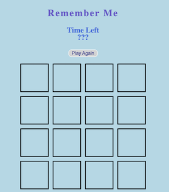

# Remember Me

## Overview
This is a memory game where the player will choose two squares at a time to make a match. The player will have a limited amount of time to determine the matches and will be informed if they won or lost the game.

###### Main Game Screen

## User Stories

- As a user, I want to...
  - click to start the game
  - click two squares at a time to determine a match
  - see the time left to play
  - be informed of win or loss
  - have the ability to play again

## Pseudocode

- Define required constants
  - array of colors
  - squareOnePicked
  - squareTwoPicked
- Define required variables used to track the state of the game
  - timer
  - squareOnePicked
  - squareTwoPicked
  - matches
- Store elements on the page that will be accessed in code more than once in variables to make code more concise, readable and performant.
- Upon loading the app should:
  - Initialize the state variables
  - Render those values to the page
  - Wait for the player to click a square
- Handle a player clicking two squares
- Handle a player clicking the replay button

## Technologies Used
- HTML5
- CSS3
- JavaScript
